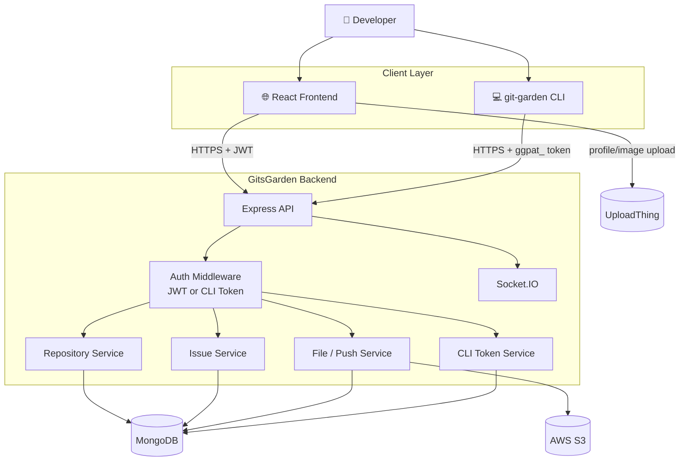
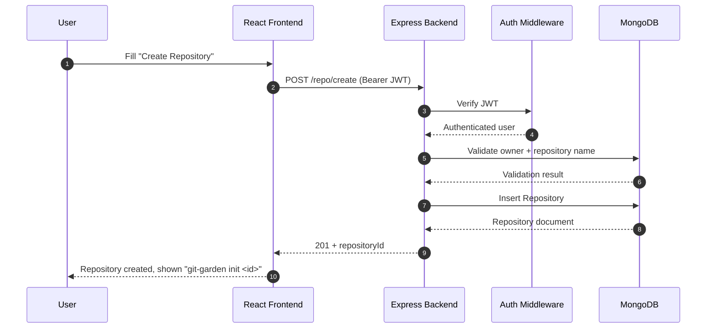
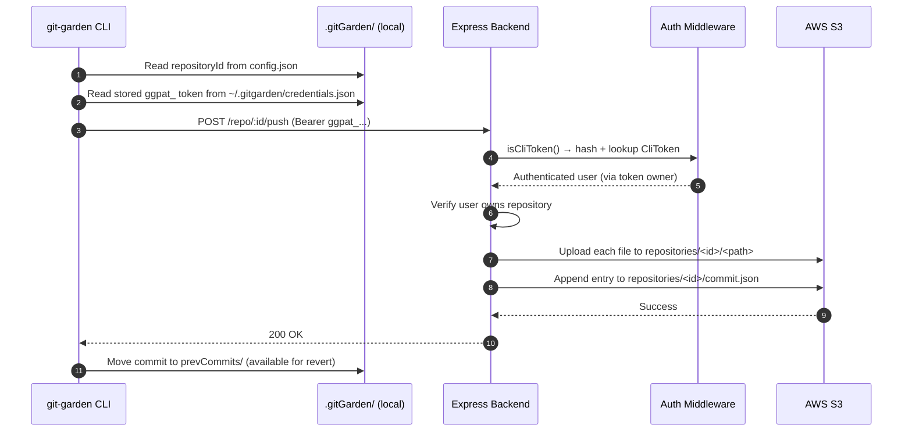
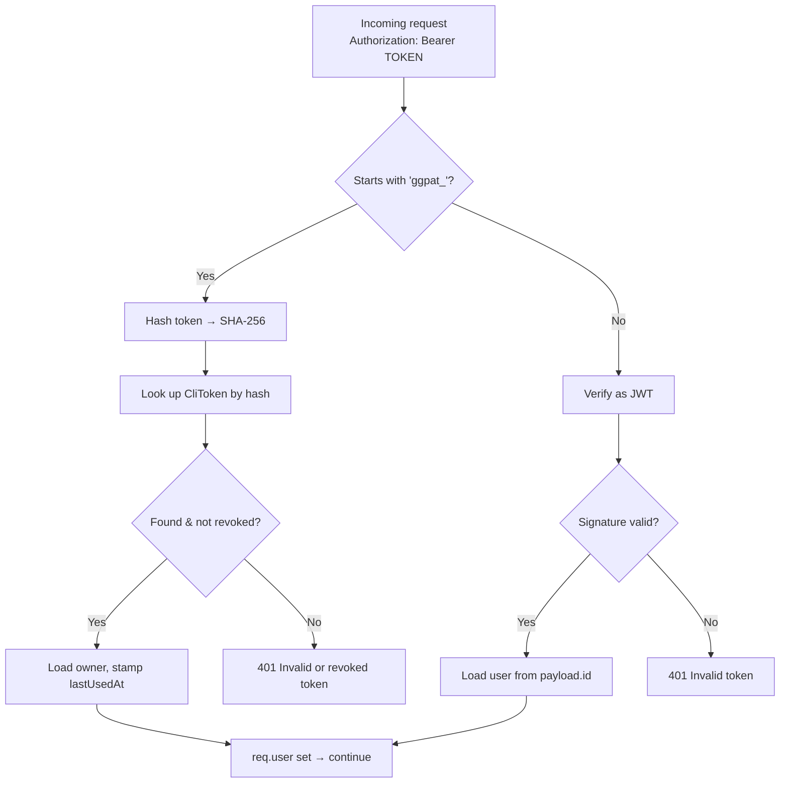
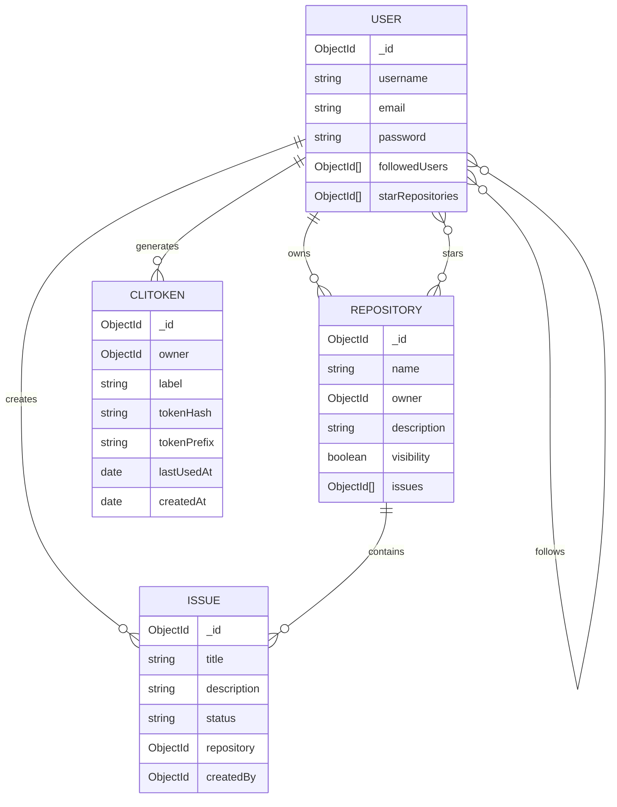
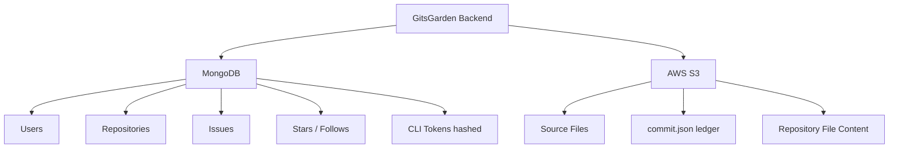
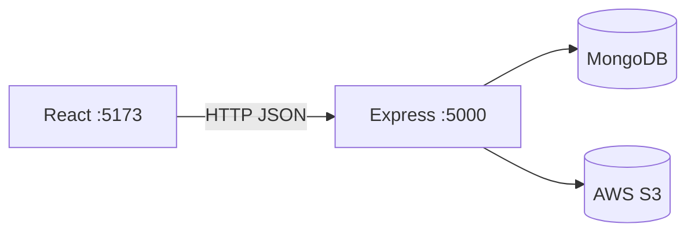
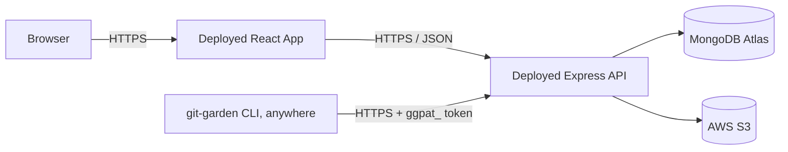
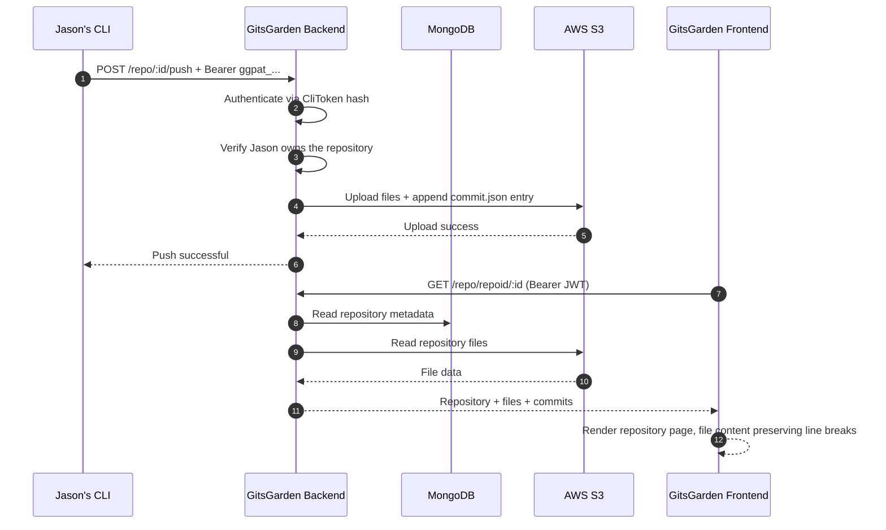

<div align="center">

# 🌑 GitsGarden

### A GitHub-inspired code hosting platform with a custom Git-like CLI

<p>
  <strong>React 19</strong> · <strong>Node.js</strong> · <strong>Express 5</strong> · <strong>MongoDB</strong> · <strong>AWS S3</strong> · <strong>JWT + CLI Tokens</strong> · <strong>Socket.IO</strong> · <strong>Primer React</strong>
</p>

<p>
  <a href="#-overview">Overview</a> ·
  <a href="#-architecture">Architecture</a> ·
  <a href="#-request-flow">Request Flow</a> ·
  <a href="#-authentication--cli-tokens">Auth & CLI Tokens</a> ·
  <a href="#-data-model">Data Model</a> ·
  <a href="#-features">Features</a> ·
  <a href="#-setup">Setup</a> ·
  <a href="#-api-overview">API</a> ·
  <a href="#-cli">CLI</a> ·
  <a href="#-project-structure">Project Structure</a>
</p>

</div>

---

## 📌 Overview

**GitsGarden** is a simplified, self-hosted GitHub-style platform for managing software repositories and developer activity.

The project combines two sides of a code-hosting system:

- a **web application** for accounts, profiles, repositories, stars, issues, repository browsing, a contribution heatmap, and CLI token management;
- a **custom Git-like command-line workflow** (`login`, `logout`, `init`, `add`, `commit`, `push`, `pull`, `revert`) that authenticates with a personal access token generated from the website — no browser session, database credentials, or AWS keys ever touch the CLI.

The core idea is to separate **application metadata** from **repository file storage**, and to keep every credential the CLI needs scoped to a single, revocable token:

```text
┌───────────────────────────────────────────────────────────────────┐
│                          GitsGarden Platform                      │
├──────────────────────────┬──────────────────────┬─────────────────┤
│ MongoDB                  │ AWS S3               │ CLI Tokens      │
│                          │                      │ (MongoDB)       │
│ Users                    │ Repository files     │                 │
│ Repositories             │ Commit snapshots     │ Hashed, per-user│
│ Issues                   │ Uploaded content     │ Prefix: ggpat_  │
│ Stars / follows          │                      │ Revocable       │
│ Repository metadata      │                      │                 │
└──────────────────────────┴──────────────────────┴─────────────────┘
```

> **Goal:** provide the core experience of a lightweight GitHub clone — including a real, working push/pull pipeline authenticated end-to-end — without attempting to reproduce the entire Git or GitHub feature set.

---

## 🎯 Project Goals

| Area | Capability |
|---|---|
| Accounts | Signup, login, JWT-based browser authentication |
| CLI Auth | Personal access tokens (`ggpat_...`) generated from the site, used only by the CLI |
| Profiles | View/update user profile, contribution heatmap |
| Social | Follow users, star repositories |
| Repositories | Create, view, update, delete, public/private |
| Issues | Create, view, update, close/open, delete |
| Files | Browse repository files, read file content, update files, correct multi-line rendering |
| Versioning | `login`, `logout`, `init`, `add`, `commit`, `push`, `pull`, `revert` |
| Storage | MongoDB for metadata + tokens, S3 for repository content |
| Real-time | Socket.IO room-based communication |
| UI | GitHub-inspired dark developer interface, built on Primer React primitives |

The project intentionally does **not** attempt to implement advanced GitHub features such as pull requests, merge workflows, branches, or tags.

---

# 🏗️ Architecture

## High-Level Design (HLD)



### Architectural responsibilities

| Component | Responsibility |
|---|---|
| **React Frontend** | UI, forms, navigation, repository screens, profile, issues, stars, CLI token management |
| **Express Backend** | REST APIs, validation, dual authentication (JWT + CLI token), authorization, business logic |
| **MongoDB** | Users, repository metadata, issues, social relationships, CLI tokens, commit ledger |
| **AWS S3** | Repository files and commit snapshots |
| **JWT** | Browser session authentication |
| **CLI Token (`ggpat_...`)** | CLI authentication, generated and revoked entirely from the website |
| **Socket.IO** | Real-time user-scoped events |
| **git-garden CLI** | Local repository state (`.gitGarden/`) and the Git-like command set |
| **UploadThing** | Application file-upload integration where used |

---

# 🔄 Request / Response Flow

## Web Request Flow

Example: creating a repository from the React frontend.



## CLI Push Flow

Example: `git-garden push`, now fully wired end-to-end.



## Generic REST response pattern

```json
{
  "message": "Operation completed successfully",
  "data": {}
}
```

```json
{
  "message": "Repository not found"
}
```

```text
200 OK          → successful read/update
201 Created     → resource created
400 Bad Request → invalid input
401 Unauthorized → missing/invalid/revoked authentication
403 Forbidden   → authenticated but not allowed
404 Not Found   → target resource does not exist
409 Conflict    → duplicate/conflicting resource
500 Server Error → unexpected server failure
```

---

# 🔐 Authentication & CLI Tokens

GitsGarden has **two independent authentication paths** that share a single middleware:



### Browser session (JWT)

```text
Signup/Login → verify credentials → sign JWT → stored client-side →
sent as "Authorization: Bearer <jwt>" on every authenticated request
```

### CLI personal access tokens (`ggpat_...`)

Modeled directly on GitHub's own Personal Access Token flow — generated from **Settings**, never printed on the public profile:

1. User logs into the website normally (JWT session).
2. Navigates to **`/settings/cli-tokens`** — reachable from the account dropdown in the navbar (next to Profile / Starred / Issues), and linked from the "repository created" success screen the moment they'd actually need one.
3. Names the token (e.g. `"my laptop"`) and clicks **Generate**.
4. The server creates a 32-byte random token, stores only its **SHA-256 hash** (`CliToken.tokenHash`) plus a display prefix, and returns the raw token **exactly once**.
5. User copies it and runs:
   ```bash
   git-garden login ggpat_XXXXXXXXXXXXXXXXXXXXXXXXXXXXXXXX
   ```
   or just `git-garden login` to be prompted interactively.
6. The token is written to `~/.gitgarden/credentials.json` (mode `0600`, per-machine, independent of any individual project folder) and reused by every `push` / `pull` / `revert` from that machine.
7. Tokens can be listed and revoked from the same `/settings/cli-tokens` page — revoking deletes the `CliToken` document, and the middleware rejects the token on the next request with `401`.

```text
~/.gitgarden/
└── credentials.json     { "token": "ggpat_..." }   ← global, per-machine

project/.gitGarden/
└── config.json           { "repositoryId": "..." }  ← per-project, no secrets
```

Why SHA-256 and not bcrypt for the token itself: the token is 32 bytes of random entropy, not a human-chosen password — it can't be brute-forced offline regardless of hash speed, so a fast, indexable hash is the right tool for an O(1) DB lookup on every CLI request.

---

# 🗃️ Data Model

```text
MongoDB
└── gitclone
    ├── users
    ├── repositories
    ├── issues
    └── clitokens
```

## Entity relationship



### Repository ownership

```text
Repository.owner → User._id
```

Recommended uniqueness rule: `(owner, name)`, not repository name alone.

---

# ☁️ MongoDB vs AWS S3



### S3 namespace (repository-ID scoped, collision-proof)

```text
repositories/
└── <repositoryId>/
    ├── commit.json          ← append-only ledger of push/pull/revert entries
    ├── README.md
    ├── package.json
    └── src/...
```

Every key is built and validated through `utils/s3Key.js` (`buildRepoFileKey` + `assertKeyBelongsToRepo`), so a request can never write or read outside the repository it's authorized for — this is enforced server-side on every push, independent of whatever the CLI sends.

---

# ✨ Features

## 👤 User Accounts

- Signup, login, JWT-based authentication
- View/update/delete profile
- **Contribution heatmap** on the profile page (GitHub-style 5-step green scale)

## 🔑 CLI Tokens

- Generate a labeled personal access token (`ggpat_...`) from `/settings/cli-tokens`
- Token shown once, copy-to-clipboard, never recoverable again
- List all active tokens with last-used timestamp
- Revoke any token instantly
- Discoverable from the navbar account dropdown and from the repo-creation success screen

## 🤝 Social Features

- Follow / unfollow users
- Star / unstar repositories, view starred repositories

## 📦 Repository Management

- Create, list, view, update, delete repositories
- Public/private visibility toggle
- Browse repository files
- One-click copyable `git-garden init <repositoryId>` command shown right after creation

## 🐛 Issues

- Create, list, view, update, open/close, delete

## 📁 Repository Files

- Read repository file tree and file contents
- Update file contents
- Preserve nested paths
- Multi-line file content renders correctly (`white-space: pre-wrap` fix — newlines used to collapse into a single line)

## 💾 Custom Git-like Workflow, fully wired

```text
login → init → add → commit → push  ──HTTPS + ggpat_ token──▶  Express  ──▶  S3
                                                                          │
                                                     pull  ◀──────────────┘
                                                       │
                                                    revert
```

The local repository metadata directory (renamed from `.repoGit`/`.apnaGit`):

```text
weather-api/
├── src/
├── package.json
├── README.md
└── .gitGarden/               ← local GitsGarden metadata
    ├── config.json           { repositoryId }
    ├── staging/
    ├── commits/
    ├── prevCommits/          ← enables revert without re-downloading from S3
    └── pullCommits/
```

Excluded from every `add`/`commit`/`pull` operation, at any depth: `.gitGarden/`, `node_modules/`, `.env`.

---

# 💻 CLI

The CLI ships as commands on the backend's Node entry point today; the working directory `.gitGarden/` layout and the token-based auth model are already designed to lift straight into a standalone `npm install -g git-garden` package with no architecture changes.

## Commands

```bash
# Authentication (per machine, not per project)
node src/index.js login [token]      # paste a ggpat_ token from Settings, or omit to be prompted
node src/index.js logout             # remove the stored token from this machine

# Per-project workflow
node src/index.js init [repositoryId]
node src/index.js add <file>         # or: add .
node src/index.js commit <message>
node src/index.js push
node src/index.js pull
node src/index.js revert <commitID>
```

### `login [token]`

Stores a CLI token in `~/.gitgarden/credentials.json`, used by every `push`/`pull`/`revert` across **all** local repos on this machine. Rejects anything not shaped like `ggpat_...` before writing it.

### `logout`

Deletes `~/.gitgarden/credentials.json`.

### `init [repositoryId]`

Creates `.gitGarden/` (`config.json`, `staging/`, `commits/`) in the current directory. `repositoryId` is optional at first — you can start committing locally and link a remote repo later by re-running `init <id>`.

### `add <file>` / `add .`

Stages a file, or everything under the current directory, into `.gitGarden/staging/`, preserving relative paths and skipping excluded paths.

### `commit <message>`

Snapshots staged content into a UUID-named commit directory with a `commit.json` (id, message, timestamps, file list), then clears staging. Refuses to commit an empty staging area.

### `push`

Reads the stored CLI token and the repo's `repositoryId`, sends each pending commit to `POST /repo/:id/push` over HTTPS, and only then moves it into `prevCommits/` locally. **No AWS or MongoDB credentials ever touch the CLI or the developer's machine** — the backend does the S3 write after re-verifying repository ownership server-side.

### `pull`

Fetches everything under `repositories/<repositoryId>/` from S3, preserving directory structure. If a local file differs from the incoming version, it's renamed to `<file>.local-backup-<timestamp>` instead of being silently overwritten.

### `revert <commitID>`

Verifies the commit belongs to the repository linked in local config, restores its snapshot from `prevCommits/` back into `commits/` (ready to re-push), and never touches `.gitGarden/` itself.

---

# 🔌 API Overview

## User APIs

```text
POST   /user/signup
POST   /user/login
GET    /user/allUsers
GET    /user/userProfile/:id
PUT    /user/updateProfile/:id
DELETE /user/deleteProfile/:id
GET    /user/:id/starRepos
PUT    /user/starRepo/:repoid
PUT    /user/unstarRepo/:repoid
```

## CLI Token APIs *(new)*

```text
POST   /cli-tokens          Create a token — returns the raw value once
GET    /cli-tokens          List this user's tokens (hash never returned)
DELETE /cli-tokens/:tokenId Revoke a token
```

## Repository APIs

```text
POST   /repo/create
GET    /repo/allrepos
GET    /repo/get/:userId
GET    /repo/repoid/:id
GET    /repo/name/:name
PUT    /repo/update/:id
PATCH  /repo/toggleVis/:id
DELETE /repo/delete/:id
POST   /repo/:id/push        CLI push endpoint — auth via ggpat_ token, new
```

## Issue APIs

```text
POST   /issue/createIssue/:id
GET    /issue/allIssues/:id
GET    /issue/:issueId
PUT    /issue/:id
DELETE /issue/:id
```

## File APIs

```text
backend/src/routes/file.routes.js
```

Repository file listing, file content retrieval, and file updates backed by the S3 storage layer.

---

# 🌐 Frontend ↔ Backend Integration

```text
frontend/.env

VITE_BASE_URI=https://your-backend.example.com
```

Vite bakes `VITE_*` variables in at **build time**, not runtime — after changing this value in your hosting provider's dashboard, trigger a fresh build/deploy (not a cached one) or the old value stays live in the already-built bundle.

```js
fetch(`${url}/repo/allrepos`)
axios.post(`${url}/user/signup`, payload)
```

The CLI has its own equivalent, read from an environment variable rather than a `.env` bundled into a build:

```bash
export GITGARDEN_API_URL=https://your-backend.example.com   # defaults to http://localhost:5000
```

### Local request path



### Production request path



The browser and CLI never need direct access to MongoDB or AWS credentials — both only ever hold a bearer token scoped to the API.

---

# ⚙️ Setup

## Prerequisites

- Node.js 18+
- npm
- MongoDB Atlas account (or MongoDB deployment)
- AWS account with an S3 bucket
- UploadThing account (only if the image/file-upload integration is used)

## 1. Clone

```bash
git clone <your-repository-url>
cd GitGarden
```

## 2. Backend installation

```bash
cd backend
npm install
```

## 3. Backend environment

Create `backend/.env`:

```env
PORT=5000

MONGODB_URI=mongodb+srv://<username>:<password>@<cluster>/<database>

JWT_SECRET_KEY=<long-random-secret>

AWS_REGION=ap-south-1
AWS_ACCESS_KEY_ID=<aws-access-key>
AWS_SECRET_ACCESS_KEY=<aws-secret-key>
S3_BUCKET=<your-bucket-name>

UPLOADTHING_SECRET_KEY=<uploadthing-secret-if-used>
```

### Security

Never commit `.env`. Keep these server-side only:

```text
MONGODB_URI
JWT_SECRET_KEY
AWS_ACCESS_KEY_ID
AWS_SECRET_ACCESS_KEY
```

## 4. Start backend

```bash
npm start
# or: node src/index.js start
```

Health check: `GET http://localhost:5000/`

## 5. Frontend installation

```bash
cd frontend
npm install
```

Create `frontend/.env`:

```env
VITE_BASE_URI=http://localhost:5000
```

```bash
npm run dev
```

Frontend: `http://localhost:5173`

## 6. Install and log in with the CLI

The CLI currently lives inside the backend project (`backend/src/index.js`); a global alias makes it feel like a real command:

```bash
cd backend
npm link                      # exposes `git-garden` globally, once package.json gets a "bin" entry
# or just: node src/index.js <command>

git-garden login               # paste the ggpat_ token from /settings/cli-tokens on the site
git-garden init <repositoryId> # repositoryId comes from the "repo created" screen
git-garden add .
git-garden commit -m "Initial commit"
git-garden push
```

---

# 🧪 Testing the Backend

```text
1.  GET    /
2.  POST   /user/signup
3.  POST   /user/login
4.  GET    /user/userProfile/:id
5.  POST   /repo/create
6.  GET    /repo/allrepos
7.  POST   /cli-tokens
8.  GET    /cli-tokens
9.  POST   /repo/:id/push   (Bearer ggpat_...)
10. DELETE /cli-tokens/:tokenId
11. PUT    /repo/update/:id
12. PATCH  /repo/toggleVis/:id
13. PUT    /user/starRepo/:repoid
14. GET    /user/:id/starRepos
15. POST   /issue/createIssue/:repoId
16. GET    /issue/allIssues/:repoId
17. PUT    /issue/:issueId
18. DELETE /issue/:issueId
```

For every endpoint also test: missing input, invalid ObjectId, missing resource, missing/invalid/revoked auth token, unauthorized user, server-side failure.

---

# 🧱 Project Structure

```text
GitGarden/
│
├── backend/
│   ├── src/
│   │   ├── config/
│   │   │   ├── aws-config.js
│   │   │   └── db-config.js
│   │   │
│   │   ├── controllers/
│   │   │   ├── user.controller.js
│   │   │   ├── repo.controller.js
│   │   │   ├── issue.controller.js
│   │   │   ├── files.controller.js        ← includes pushSnapshot (S3 write)
│   │   │   ├── cliToken.controller.js     ← new
│   │   │   └── terminalCommands/
│   │   │       ├── repoConfig.js          ← new: shared path/exclude helpers
│   │   │       ├── login.js               ← new
│   │   │       ├── logout.js              ← new
│   │   │       ├── init.js
│   │   │       ├── add.js
│   │   │       ├── commit.js
│   │   │       ├── push.js                ← now calls the backend, no direct S3
│   │   │       ├── pull.js
│   │   │       └── revert.js
│   │   │
│   │   ├── middlewares/
│   │   │   ├── authe.middleware.js        ← dual JWT / CLI-token auth
│   │   │   └── autho.middleware.js
│   │   │
│   │   ├── models/
│   │   │   ├── user.model.js
│   │   │   ├── repo.model.js
│   │   │   ├── issue.model.js
│   │   │   └── cliToken.model.js          ← new
│   │   │
│   │   ├── routes/
│   │   │   ├── main.routes.js
│   │   │   ├── user.routes.js
│   │   │   ├── repo.routes.js             ← includes POST /:id/push
│   │   │   ├── issue.routes.js
│   │   │   ├── file.routes.js
│   │   │   └── cliToken.routes.js         ← new
│   │   │
│   │   ├── utils/
│   │   │   ├── helper.js
│   │   │   ├── uploadthing.js
│   │   │   ├── s3Key.js                   ← key building + repo-scope validation
│   │   │   ├── cliToken.js                ← new: generate/hash/detect ggpat_ tokens
│   │   │   └── globalConfig.js            ← new: ~/.gitgarden/credentials.json
│   │   │
│   │   └── index.js
│   │
│   └── package.json
│
├── frontend/
│   ├── src/
│   │   ├── components/
│   │   │   ├── auth/
│   │   │   │   ├── Login.jsx
│   │   │   │   └── Signup.jsx
│   │   │   ├── dashboard/
│   │   │   │   └── Dashboard.jsx
│   │   │   ├── issue/
│   │   │   │   └── IssueModal.jsx
│   │   │   ├── repo/
│   │   │   │   ├── Form.jsx               ← links to /settings/cli-tokens after create
│   │   │   │   ├── Repo.jsx               ← file viewer, pre-wrap newline fix
│   │   │   │   ├── StarRepo.jsx
│   │   │   │   └── file.jsx
│   │   │   ├── user/
│   │   │   │   ├── Profile.jsx
│   │   │   │   ├── CliTokens.jsx          ← new: generate/list/revoke tokens
│   │   │   │   ├── cliTokens.css          ← new
│   │   │   │   ├── HeatMap.jsx            ← new: contribution heatmap
│   │   │   │   └── hashmap.css            ← new
│   │   │   └── Navbar.jsx                 ← "CLI Tokens" entry in account dropdown
│   │   │
│   │   ├── authContext.jsx
│   │   ├── Routes.jsx                     ← includes /settings/cli-tokens
│   │   ├── index.css                      ← GitHub-dark design tokens
│   │   └── main.jsx
│   │
│   └── package.json
│
└── README.md
```

---

# 🧩 Backend Module Responsibilities

| Directory | Responsibility |
|---|---|
| `config/` | MongoDB, AWS S3, UploadThing configuration |
| `controllers/` | Business operations for users, repositories, issues, files, CLI tokens |
| `middlewares/` | Cross-cutting request processing — dual JWT/CLI-token authentication, authorization |
| `models/` | MongoDB/Mongoose schemas, including `CliToken` |
| `routes/` | HTTP endpoint definitions and controller mapping |
| `terminalCommands/` | Local Git-like operations plus `login`/`logout` credential management |
| `utils/` | Shared helpers: S3 key scoping, token hashing, global CLI credentials |

---

# 🎨 Frontend Design Direction

Built on **Primer React** primitives (`@primer/react`, `@primer/react-brand`) layered with a hand-tuned GitHub-dark CSS variable system in `index.css`, plus `lucide-react` icons and `react-hot-toast` for notifications.

```text
Near-black background
Dark gray panels
Subtle gray borders
White primary text
Muted secondary text
Blue repository links
Green primary actions
Compact developer-focused controls
```

The UI avoids: large marketing cards, excessive gradients, glassmorphism, neon styling, heavy animation.

The repository page is the primary visual surface:

```text
owner / repository → description → actions → files → commit history → issues
```

The CLI Tokens page follows the same token palette (`--gh-panel`, `--gh-border`, `--gh-green`, etc.) rather than inventing new colors, with a real flex layout (row on desktop, stacked under 520px) so the generate button and input never overlap.

---

# 🔒 Security Principles

1. **Passwords are hashed** before storage.
2. **JWT secrets remain server-side.**
3. **AWS credentials remain server-side** — the CLI never receives them; `push`/`pull` go through the authenticated API.
4. **CLI tokens are stored as SHA-256 hashes**, never in plaintext; the raw value is shown exactly once, at creation.
5. **CLI tokens are scoped per user and independently revocable** without touching the user's password or JWT session.
6. **Frontend never connects directly to MongoDB.**
7. **Repository ownership is validated server-side** on every push, regardless of what the client claims.
8. **Repository IDs isolate S3 data** — every key is built and checked through `buildRepoFileKey` / `assertKeyBelongsToRepo`.
9. **`.env` files must never be committed.**
10. **`.gitGarden/` metadata is never uploaded as project content** — excluded at every depth in `add`, `commit`, and `pull`.
11. **Local CLI credentials are written with `0600` permissions** in `~/.gitgarden/credentials.json`, separate from any project directory.

---

# 🚀 Deployment Model

```text
                         Internet
                            │
               ┌────────────┴────────────┐
               │                         │
               ▼                         ▼
        React Frontend              git-garden CLI
         (Vercel/etc.)              (any machine)
               │                         │
               │ HTTPS + JWT             │ HTTPS + ggpat_ token
               └────────────┬────────────┘
                            ▼
                    Express Backend
                     (Node.js server)
                       /       \
                      /         \
                     ▼           ▼
              MongoDB Atlas     AWS S3
          metadata + tokens      files
```

The browser and CLI are **clients**; the Express application is the **remote service** responsible for authentication, authorization, database access, and storage operations.

---

# 🔮 Roadmap

The core client/server split is done — login, token issuance/revocation, and a fully working `push`/`pull`/`revert` pipeline are live. What's left is packaging, not architecture:

```text
GitGarden/
├── backend/
├── frontend/
└── git-garden-cli/     ← extract terminalCommands/ + globalConfig.js into this
```

```bash
npm install -g git-garden

git-garden login
git-garden init <repositoryId>
git-garden add .
git-garden commit -m "Initial commit"
git-garden push
git-garden pull
git-garden revert <commitId>
git-garden logout
```

No code in `terminalCommands/` currently imports Mongoose models or the AWS SDK directly — `push` and `pull` already talk to the backend/S3 only through HTTP and the S3 SDK using nothing but the locally stored token, so extraction is mostly a `package.json` + `bin` field exercise rather than a rewrite.

Other open items:
- Style pass on any remaining unstyled pages (CLI Tokens page is done; check for others as they come up)
- Confirm multi-line file edits round-trip correctly through `updateRepoFileContent` (the S3 write path), since the recent newline fix only touched the read/display path

---

# 🧭 End-to-End Example

## Jason uploads `weather-api`

### Web

```text
Jason signs up → logs in → generates a CLI token at /settings/cli-tokens
      ↓
Creates repository → jason/weather-api
      ↓
Copies "git-garden init 6a9d5573f9c613644409622f" from the success screen
```

### Local project

```bash
git-garden login ggpat_XXXXXXXXXXXXXXXXXXXXXXXXXXXXXXXX
git-garden init 6a9d5573f9c613644409622f
git-garden add .
git-garden commit "Initial weather API"
git-garden push
```

### Remote flow



---

# 🤝 Development Guidelines

```text
Frontend
  ↓ HTTP (JWT)
Backend
  ↓
Services/controllers
  ↓
MongoDB + S3

CLI
  ↓ HTTP (ggpat_ token)
Backend  (same entry point, same auth middleware)
```

```text
Routes       → route definitions
Controllers  → request/business coordination
Models       → persistence schema
Middleware   → dual auth (JWT + CLI token) / authorization
CLI          → local filesystem (.gitGarden/) + remote HTTP client, no direct DB/S3 access
```

Avoid putting database logic directly into React components, exposing AWS credentials to any client, or letting `terminalCommands/` import Mongoose models or the AWS SDK directly — that coupling is exactly what push/pull were refactored away from.

---

# 📄 License

Add your preferred license here before publishing the project publicly.

---

<div align="center">

### 🌑 GitsGarden

**A focused GitHub clone demonstrating full-stack development, storage architecture, dual-mode authentication, repository management, and a real, token-authenticated Git-like CLI workflow.**

</div>