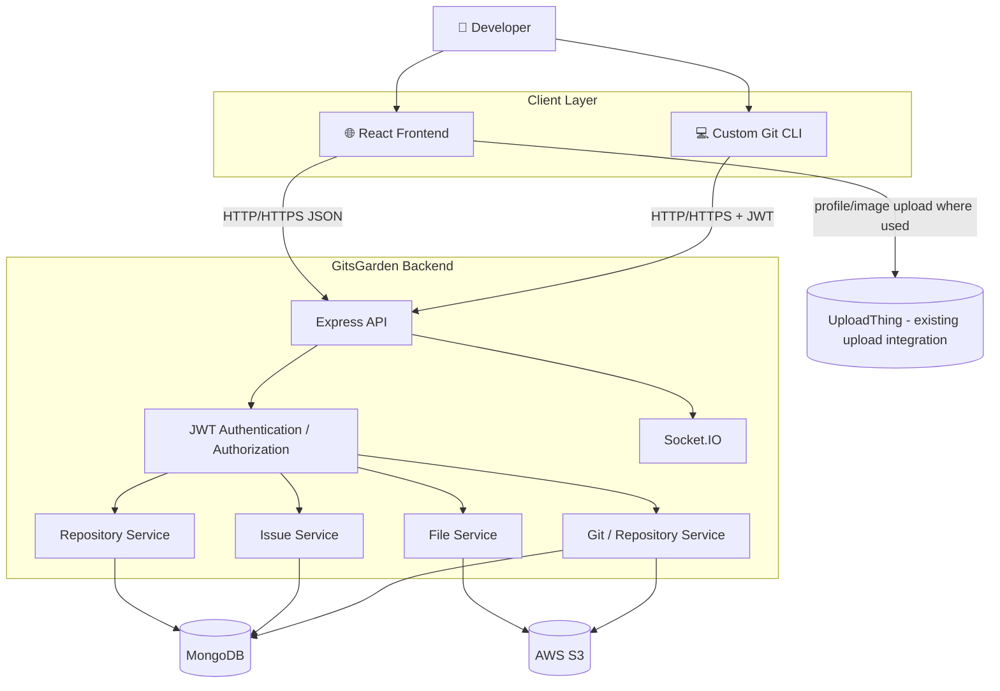
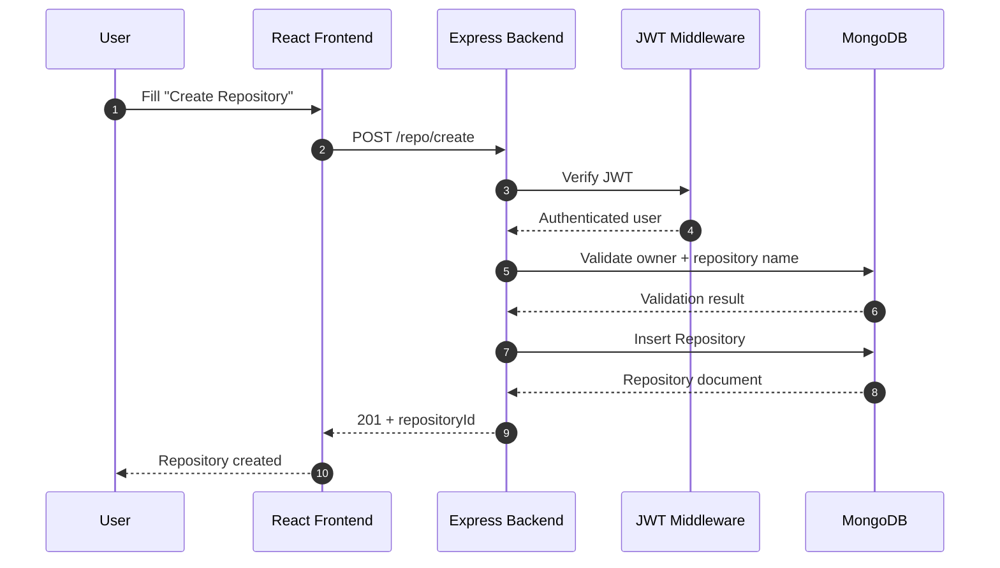
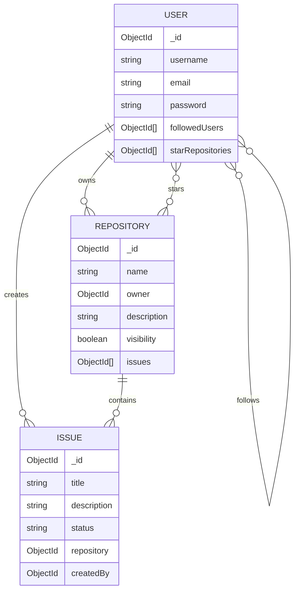
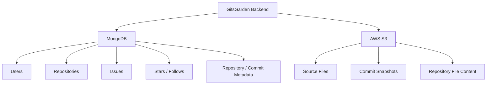
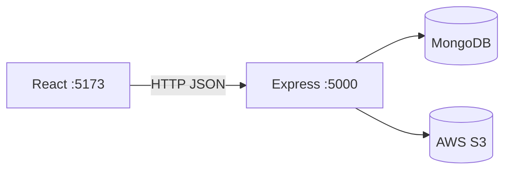
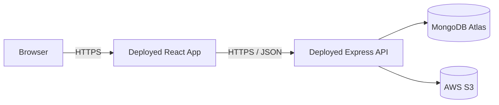
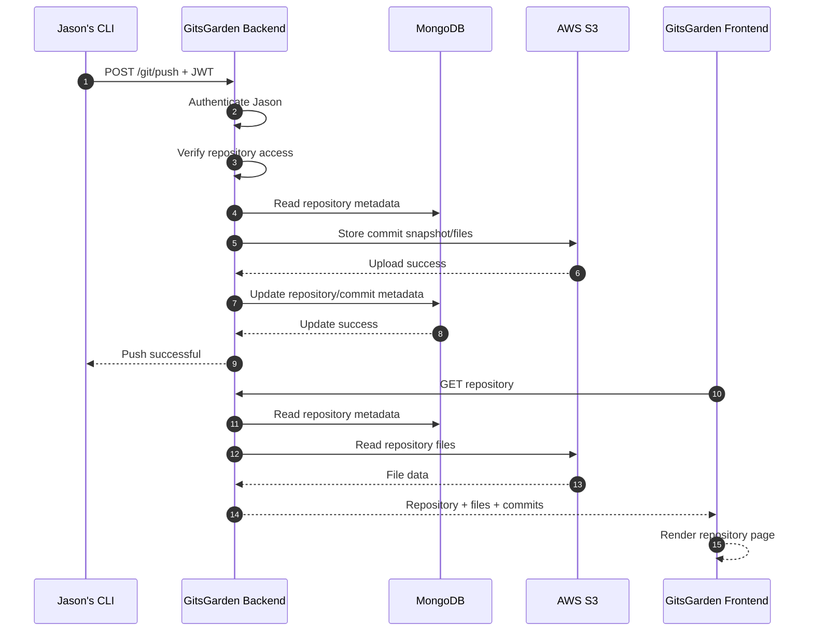

<div align="center">

# 🌑 GitsGarden

### A GitHub-inspired code hosting platform with a custom Git-like CLI

<p>
  <strong>React</strong> · <strong>Node.js</strong> · <strong>Express</strong> · <strong>MongoDB</strong> · <strong>AWS S3</strong> · <strong>JWT</strong> · <strong>Socket.IO</strong>
</p>

<p>
  <a href="#-overview">Overview</a> ·
  <a href="#-architecture">Architecture</a> ·
  <a href="#-request-flow">Request Flow</a> ·
  <a href="#-data-model">Data Model</a> ·
  <a href="#-features">Features</a> ·
  <a href="#-setup">Setup</a> ·
  <a href="#-api-overview">API</a> ·
  <a href="#-cli">CLI</a> ·
  <a href="#-project-structure">Project Structure</a>
</p>

</div>

---

## 📌 Overview

**GitsGarden** is a simplified, self-hosted GitHub-style platform for managing software repositories and developer activity.

The project combines two sides of a code-hosting system:

- a **web application** for accounts, profiles, repositories, stars, issues, and repository browsing;
- a **custom Git-like command-line workflow** for initializing a local repository, staging files, creating commits, pushing repository snapshots, pulling repository data, and reverting to an earlier commit.

The core idea is to separate **application metadata** from **repository file storage**:

```text
┌─────────────────────────────────────────────────────────┐
│                    GitsGarden Platform                  │
├──────────────────────────┬──────────────────────────────┤
│ MongoDB                  │ AWS S3                       │
│                          │                              │
│ Users                    │ Repository files             │
│ Repositories             │ Commit snapshots             │
│ Issues                   │ Uploaded source content      │
│ Stars / follows          │                              │
│ Repository metadata      │                              │
└──────────────────────────┴──────────────────────────────┘
```

> **Goal:** provide the core experience of a lightweight GitHub clone without attempting to reproduce the entire Git or GitHub feature set.

---

## 🎯 Project Goals

The system is designed around these current capabilities:

| Area | Capability |
|---|---|
| Accounts | Signup, login, JWT-based authentication |
| Profiles | View/update user profile |
| Social | Follow users, star repositories |
| Repositories | Create, view, update, delete, public/private |
| Issues | Create, view, update, close/open, delete |
| Files | Browse repository files, read file content, update files |
| Versioning | `init`, `add`, `commit`, `push`, `pull`, `revert` |
| Storage | MongoDB for metadata, S3 for repository content |
| Real-time | Socket.IO room-based communication |
| UI | GitHub-inspired dark developer interface |

The project intentionally does **not** attempt to implement advanced GitHub features such as pull requests, merge workflows, tags, GitHub Actions, or team administration.

---

# 🏗️ Architecture

## High-Level Design (HLD)



### Architectural responsibilities

| Component | Responsibility |
|---|---|
| **React Frontend** | UI, forms, navigation, repository screens, profile, issues, stars, follows |
| **Express Backend** | REST APIs, validation, authentication, authorization, business logic |
| **MongoDB** | Users, repository metadata, issues, social relationships, commit metadata/references |
| **AWS S3** | Repository files and commit snapshots |
| **JWT** | Identifying authenticated users |
| **Socket.IO** | Real-time user-scoped events |
| **Custom CLI** | Local repository state and Git-like commands |
| **UploadThing** | Existing application file-upload integration where used |

---

# 🔄 Request / Response Flow

## Web Request Flow

Example: creating a repository from the React frontend.



## Generic REST response pattern

A successful response should contain a predictable JSON body:

```json
{
  "message": "Operation completed successfully",
  "data": {}
}
```

Errors should be explicit:

```json
{
  "message": "Repository not found"
}
```

Recommended status meanings:

```text
200 OK          → successful read/update
201 Created     → resource created
400 Bad Request → invalid input
401 Unauthorized → missing/invalid authentication
403 Forbidden   → authenticated but not allowed
404 Not Found   → target resource does not exist
409 Conflict    → duplicate/conflicting resource
500 Server Error → unexpected server failure
```

---

# 🔐 Authentication Flow

```mermaid
flowchart LR
    A[Signup/Login] --> B[Express User API]
    B --> C[Validate credentials]
    C --> D[Hash / compare password]
    D --> E[Create JWT]
    E --> F[Frontend stores token]
    F --> G[Authenticated request]
    G --> H[JWT middleware]
    H --> I[req.user]
    I --> J[Protected operation]
```



### Token flow

```text
Browser / CLI
     │
     │ Authorization: Bearer <token>
     ▼
Express backend
     │
     ├── verify JWT
     ├── identify user
     └── authorize operation
```

Secrets such as the JWT signing key, MongoDB URI, and AWS credentials remain on the server and are never shipped to the browser or CLI.

---

# 🗃️ Data Model

The application uses a shared MongoDB database for application data.

```text
MongoDB
└── gitclone
    ├── users
    ├── repositories
    └── issues
```

## Entity relationship



### Repository ownership

Repositories are stored in a **global repository collection**. The owner relationship is represented by:

```text
Repository.owner → User._id
```

This allows:

```text
Jason/weather-api   ✅
Alice/weather-api   ✅
Jason/weather-api   ❌ duplicate
```

The recommended uniqueness rule is:

```text
(owner, name)
```

not repository name alone.

---

# ☁️ MongoDB vs AWS S3

The storage split is intentional.



### Recommended S3 namespace

Repository identity should be based on **repository ID**, not only repository name:

```text
repositories/
└── <repositoryId>/
    └── commits/
        ├── <commitId>/
        │   ├── commit.json
        │   ├── README.md
        │   ├── package.json
        │   └── src/...
        └── <commitId>/
```

This prevents collisions such as:

```text
Jason/weather-api
Alice/weather-api
```

---

# ✨ Features

## 👤 User Accounts

- Create an account
- Login with email/password
- JWT-based authentication
- View profile
- Update profile
- Delete profile

## 🤝 Social Features

- Follow users
- Unfollow users
- Star repositories
- Unstar repositories
- View starred repositories

## 📦 Repository Management

- Create repositories
- Public/private visibility
- List repositories
- View a repository
- Update repository metadata
- Delete repositories
- View repository owner
- Browse repository files

## 🐛 Issues

- Create issue
- List repository issues
- View issue
- Update issue
- Open/close issue
- Delete issue

## 📁 Repository Files

- Read repository file tree
- Read file contents
- Update file contents
- Preserve nested paths

## 💾 Custom Git-like Workflow

The project contains a custom Git-inspired local workflow:

```text
init → add → commit → push
                    ↓
                  S3
                    ↓
                   pull
                    ↓
                 revert
```

The local repository metadata directory is analogous to `.git`:

```text
weather-api/
├── src/
├── package.json
├── README.md
└── .repoGit/        ← local GitsGarden metadata
    ├── config.json
    ├── staging/
    ├── commits/
    ├── prevCommits/
    └── pullCommits/
```

---

# 💻 CLI

The current implementation uses **Yargs** and exposes Git-like commands through the Node entry point.

> The current repository keeps the CLI implementation inside the backend project. A future standalone `apnagit` npm package can extract these same local operations without changing the remote storage architecture.

## Current commands

```bash
node src/index.js init
node src/index.js add <file>
node src/index.js commit <message>
node src/index.js push <username> <repoName>
node src/index.js pull <repoName>
node src/index.js revert <commitID> <repoName>
```

### `init`

Creates `.repoGit/` in the current working directory.

### `add`

Stages a file for the next commit.

### `commit`

Creates a UUID-based snapshot containing commit metadata and staged project content.

### `push`

Uploads repository content to AWS S3 through the existing backend/CLI integration.

### `pull`

Retrieves repository content from remote S3 storage.

### `revert`

Restores a previous stored repository snapshot.

---

# 🔌 API Overview

The exact routes are defined under `backend/src/routes/`.

## User APIs

```text
POST   /user/signup
POST   /user/login
GET    /user/allUsers
GET    /user/userProfile/:id
PUT    /user/updateProfile/:id
DELETE /user/deleteProfile/:id
GET    /user/:id/starRepos
PUT    /user/starRepo/:repoid
PUT    /user/unstarRepo/:repoid
```

## Repository APIs

```text
POST   /repo/create
GET    /repo/allrepos
GET    /repo/get/:userId
GET    /repo/repoid/:id
GET    /repo/name/:name
PUT    /repo/update/:id
PATCH  /repo/toggleVis/:id
DELETE /repo/delete/:id
```

## Issue APIs

```text
POST   /issue/createIssue/:id
GET    /issue/allIssues/:id
GET    /issue/:issueId
PUT    /issue/:id
DELETE /issue/:id
```

## File APIs

File routes are defined in:

```text
backend/src/routes/file.routes.js
```

They support repository file listing, file content retrieval, and file updates backed by the repository storage layer.

---

# 🌐 Frontend ↔ Backend Integration

The frontend communicates with the backend using the configured base URL.

```text
frontend/.env

VITE_BASE_URI=http://localhost:5000
```

The frontend then builds requests such as:

```js
fetch(`${url}/repo/allrepos`)
```

or:

```js
axios.post(`${url}/user/signup`, payload)
```

### Local request path



### Production request path



The browser never needs direct access to MongoDB or AWS credentials.

---

# ⚙️ Setup

## Prerequisites

- Node.js 18+
- npm
- MongoDB Atlas account (or MongoDB deployment)
- AWS account with an S3 bucket
- UploadThing account only if the existing image/file-upload integration is used

---

## 1. Clone

```bash
git clone <your-repository-url>
cd GitHubClone
```

---

## 2. Backend installation

```bash
cd backend
npm install
```

---

## 3. Backend environment

Create:

```text
backend/.env
```

Example:

```env
PORT=5000

MONGODB_URI=mongodb+srv://<username>:<password>@<cluster>/<database>

JWT_SECRET_KEY=<long-random-secret>

AWS_REGION=ap-south-1
AWS_ACCESS_KEY_ID=<aws-access-key>
AWS_SECRET_ACCESS_KEY=<aws-secret-key>
S3_BUCKET=<your-bucket-name>

UPLOADTHING_SECRET_KEY=<uploadthing-secret-if-used>
```

### Security

Never commit `.env` to Git.

Do not put these in the frontend:

```text
MONGODB_URI
JWT_SECRET_KEY
AWS_ACCESS_KEY_ID
AWS_SECRET_ACCESS_KEY
```

---

## 4. Start backend

```bash
npm start
```

or:

```bash
node src/index.js start
```

Expected local API:

```text
http://localhost:5000
```

Health check:

```http
GET http://localhost:5000/
```

---

## 5. Frontend installation

Open another terminal:

```bash
cd frontend
npm install
```

Create:

```text
frontend/.env
```

```env
VITE_BASE_URI=http://localhost:5000
```

Start:

```bash
npm run dev
```

Frontend:

```text
http://localhost:5173
```

---

# 🧪 Testing the Backend

A recommended manual API sequence is:

```text
1. GET    /
2. POST   /user/signup
3. POST   /user/login
4. GET    /user/userProfile/:id
5. POST   /repo/create
6. GET    /repo/allrepos
7. GET    /repo/get/:userId
8. GET    /repo/repoid/:id
9. PUT    /repo/update/:id
10. PATCH /repo/toggleVis/:id
11. PUT   /user/starRepo/:repoid
12. GET   /user/:id/starRepos
13. PUT   /user/unstarRepo/:repoid
14. POST  /issue/createIssue/:repoId
15. GET   /issue/allIssues/:repoId
16. PUT   /issue/:issueId
17. DELETE /issue/:issueId
```

For every endpoint also test:

```text
missing input
invalid ObjectId
missing resource
invalid authentication
unauthorized user
server-side failure
```

---

# 🧱 Project Structure

```text
GitHubClone-main/
│
├── backend/
│   ├── src/
│   │   ├── config/
│   │   │   ├── aws-config.js
│   │   │   └── db-config.js
│   │   │
│   │   ├── controllers/
│   │   │   ├── user.controller.js
│   │   │   ├── repo.controller.js
│   │   │   ├── issue.controller.js
│   │   │   ├── files.controller.js
│   │   │   └── terminalCommands/
│   │   │       ├── init.js
│   │   │       ├── add.js
│   │   │       ├── commit.js
│   │   │       ├── push.js
│   │   │       ├── pull.js
│   │   │       └── revert.js
│   │   │
│   │   ├── middlewares/
│   │   │   ├── authe.middleware.js
│   │   │   └── autho.middleware.js
│   │   │
│   │   ├── models/
│   │   │   ├── user.model.js
│   │   │   ├── repo.model.js
│   │   │   └── issue.model.js
│   │   │
│   │   ├── routes/
│   │   │   ├── main.routes.js
│   │   │   ├── user.routes.js
│   │   │   ├── repo.routes.js
│   │   │   ├── issue.routes.js
│   │   │   └── file.routes.js
│   │   │
│   │   ├── utils/
│   │   │   ├── helper.js
│   │   │   └── uploadthing.js
│   │   │
│   │   └── index.js
│   │
│   └── package.json
│
├── frontend/
│   ├── src/
│   │   ├── components/
│   │   │   ├── auth/
│   │   │   ├── dashboard/
│   │   │   ├── issue/
│   │   │   ├── repo/
│   │   │   ├── user/
│   │   │   └── Navbar.jsx
│   │   │
│   │   ├── authContext.jsx
│   │   ├── Routes.jsx
│   │   ├── index.css
│   │   └── main.jsx
│   │
│   └── package.json
│
└── README.md
```

---

# 🧩 Backend Module Responsibilities

### `config/`

External-service configuration:

```text
MongoDB
AWS S3
UploadThing
```

### `controllers/`

Business operations for:

```text
users
repositories
issues
files
```

### `middlewares/`

Cross-cutting request processing such as authentication and authorization.

### `models/`

MongoDB/Mongoose schemas.

### `routes/`

HTTP endpoint definitions and controller mapping.

### `terminalCommands/`

Local Git-like operations.

---

# 🎨 Frontend Design Direction

The frontend follows a **classic GitHub-inspired dark theme** rather than a generic dashboard.

Visual principles:

```text
Near-black background
Dark gray panels
Subtle gray borders
White primary text
Muted secondary text
Blue repository links
Green primary actions
Compact developer-focused controls
```

The UI intentionally avoids:

```text
❌ Large marketing cards
❌ Excessive gradients
❌ Glassmorphism
❌ Neon styling
❌ Heavy animation
```

The repository page is the primary visual surface and should emphasize:

```text
owner / repository
↓
description
↓
actions
↓
files
↓
commit history
↓
issues
```

---

# 🔒 Security Principles

The application should follow these rules:

1. **Passwords are hashed** before storage.
2. **JWT secrets remain server-side.**
3. **AWS credentials remain server-side.**
4. **Frontend never connects directly to MongoDB.**
5. **CLI never receives AWS credentials.**
6. **Repository ownership is validated on the backend.**
7. **Repository IDs isolate S3 data.**
8. **`.env` files must never be committed.**
9. **`.repoGit` / `.apnaGit` metadata must never be uploaded as project content.**
10. **Input validation and ObjectId validation should happen before database operations.**

---

# 🚀 Deployment Model

A typical production deployment looks like:

```text
                         Internet
                            │
               ┌────────────┴────────────┐
               │                         │
               ▼                         ▼
        React Frontend              Custom CLI
         (Vercel/etc.)             (npm package)
               │                         │
               │ HTTPS                   │ HTTPS
               └────────────┬────────────┘
                            ▼
                    Express Backend
                     (Node.js server)
                       /       \
                      /         \
                     ▼           ▼
              MongoDB Atlas     AWS S3
               metadata         files
```

The browser and CLI are **clients**. The Express application is the **remote service** responsible for authentication, authorization, database access, and storage operations.

---

# 🔮 Intended Git Client Evolution

The current codebase keeps the custom commands inside the backend project. The intended clean separation is:

```text
GitClone/
├── backend/
├── frontend/
└── apnagit-cli/
```

The future standalone CLI should provide:

```bash
npm install -g apnagit

apnagit login
apnagit init
apnagit remote add origin <repository-url>
apnagit add .
apnagit commit -m "Initial commit"
apnagit push
apnagit pull
apnagit revert <commitId>
```

Its communication model should be:

```text
apnagit CLI
     │
     │ HTTPS + JWT
     ▼
Express Backend
     │
     ├── MongoDB
     └── AWS S3
```

The CLI should **never** contain MongoDB credentials, AWS credentials, or the backend's private secrets.

---

# 🧭 End-to-End Example

## Jason uploads `weather-api`

### Web

```text
Jason signs up
      ↓
Logs in
      ↓
Creates repository
      ↓
jason/weather-api
```

### Local project

```text
weather-api/
├── package.json
├── server.js
├── README.md
└── src/
```

### Local version-control flow

```bash
apnagit login
apnagit init
apnagit remote add origin https://gitclone.example/jason/weather-api.git
apnagit add .
apnagit commit -m "Initial weather API"
apnagit push
```

### Remote flow



---

# 🤝 Development Guidelines

When extending the project, preserve these boundaries:

```text
Frontend
  ↓ HTTP
Backend
  ↓
Services/controllers
  ↓
MongoDB + S3
```

Keep responsibilities modular:

```text
Routes       → route definitions
Controllers  → request/business coordination
Services     → reusable business/storage logic
Models       → persistence schema
Middleware   → auth/authorization
CLI          → local filesystem + remote HTTP client
```

Avoid putting database logic directly into React components or exposing AWS credentials to clients.

---

# 📄 License

Add your preferred license here before publishing the project publicly.

---

<div align="center">

### 🌑 GitsGarden

**A focused GitHub clone built to demonstrate full-stack development, storage architecture, authentication, repository management, and custom version-control workflows.**

</div>
